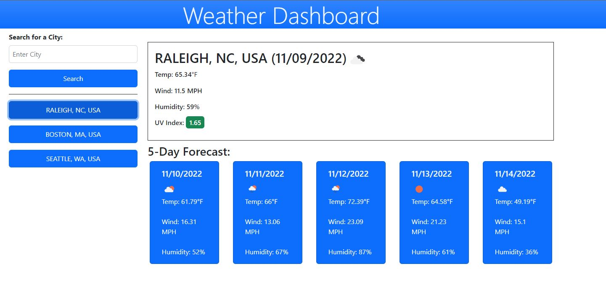

# Weather Dashboard API

The goal of this project was to check the weather based off of a city, as well as a five day forecast from a server side API.

To complete this task, the app has to make two calls: first taking the City, State and Country code (ex. Raleigh, NC, USA), converting that into lat and lon coordinates- then a second API call to get the weather based off of those coordinates.

The search queries are also saved in local storage, to be recalled at a later time.

# Technology Used
- moment.js
- jQuery
- Bootstrap

This served as a nice refresher into the working of local storage, as well as earlier API calls.

# Screenshot
